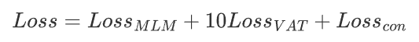
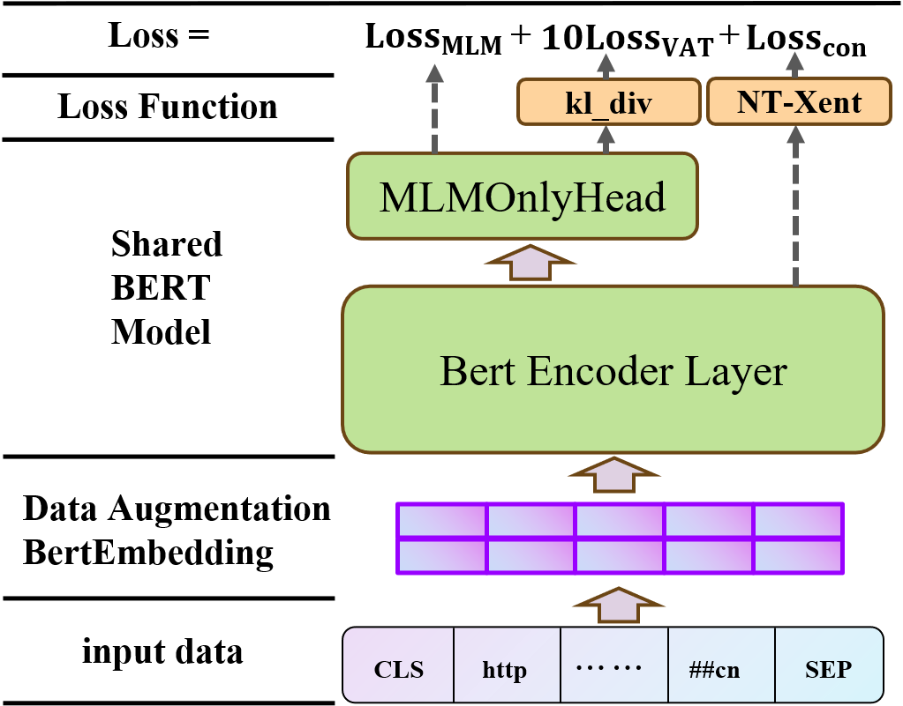

# URLBERT: A Contrastive and Adversarial Pre-trained Model for URL Classification
This is an implementation of the paper - "URLBERT: A Contrastive and Adversarial Pre-trained Model for URL Classification"

### Overview

For the convenience of research in the field of URL analysis, we trained URLBERT, a pre-trained model based on BERT, using a large-scale unlabeled URL dataset. URLBERT is intended for various downstream tasks related to URL analysis. In comparisons with traditional neural networks in both URL-related downstream tasks and the broader field of NLP, URLBERT consistently achieves state-of-the-art (SOTA) performance.

### Training Design

During the pre-training phase, we employed BERT's Masked Language Modeling (MLM) task. Additionally, we designed specific self-supervised contrastive learning tasks at the sentence level and token-level virtual adversarial training tasks. The training losses for these two tasks are denoted as Loss_con and Loss_VAT, respectively. The overall loss is defined as follows:





### Directory Guide

| Folder/File Name  | Description                                                  |
| ----------------- | ------------------------------------------------------------ |
| ./bert_config/    | configuration of the BertForMaskedLM model                   |
| ./bert_model/     | store the URLBERT model                                      |
| ./bert_tokenizer/ | vocab especially trained using URL data                      |
| ./dataset         | dataset used for finetuning(`grambedding`: phishing URL detection; `advertising`: advertisement URL detection; `Multiple`: web theme classification) |
| ./finetune        | experiment codes(`phishing`: phishing URL detection; `advertising`: advertisement URL detection; `web_classification`: web theme classification; `Multi-Task`: Multi-Task Learning) |
| .                 | program for URLBERT pre-training                             |

### Usage

```
Python==3.8

numpy==1.24.1
pandas==2.0.3
seaborn==0.13.1
tokenizers==0.14.1
torch==2.0.0+cu118
torchaudio==2.0.1+cu118
torchvision==0.15.1+cu118
transformers==4.36.2
tqdm==4.65.0
```

### Usage

In all datasets for training or testing, each line includes the label and the URL text string following the template:

for example:

```
http://minsotc.alania.gov.ru	malicious
http://zonaderegistrosenlineabnweb1.com/BNWeb/lnicio/	benign 
```

During pre-training, you can run the following command in the terminal:

``` 
python main_multiple.py // multiple GPUs needed
```

You can set the training hyperparameters in `options.py` to facilitate personalized pre-training.

Please note that before pre-training, run `tokenize.py` to tokenize the dataset text into token values that can be used as model inputs for training.